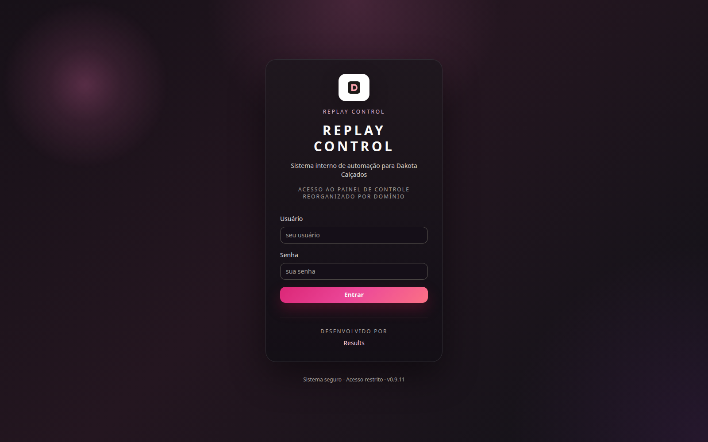
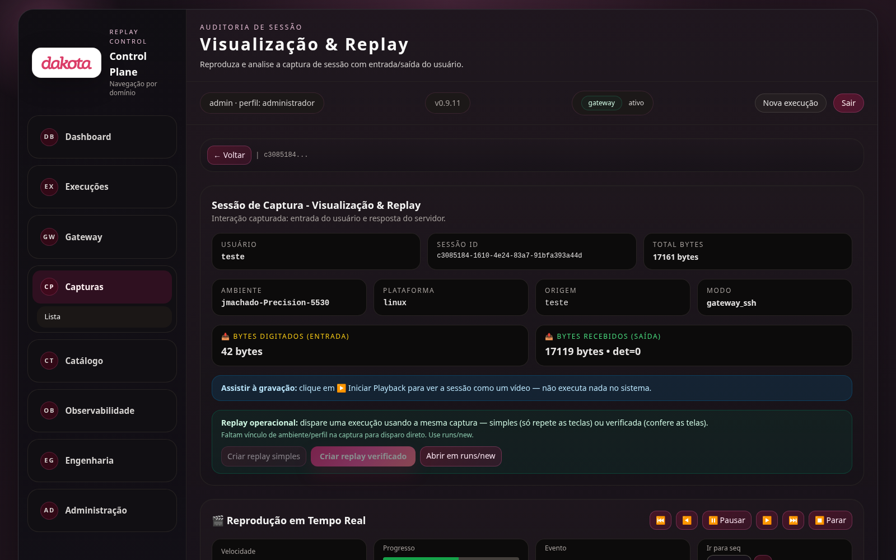
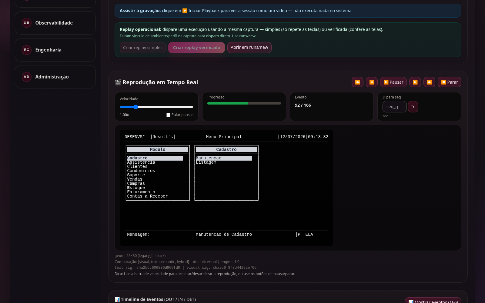
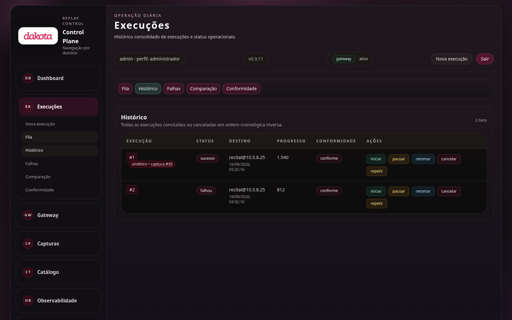
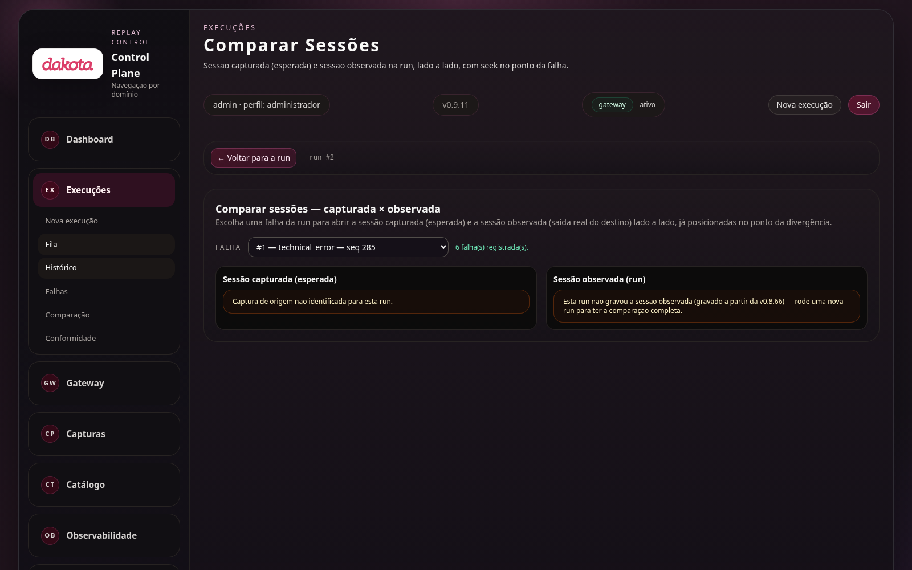

# Manual do Usuário — Dakota Replay2

**Produto:** Dakota Replay2 · **Versão:** 0.9.11 · **Data:** setembro/2026
**Público:** operadores e analistas que usam o painel de controle (não é
necessário conhecimento técnico de programação)

---

## 1. O que é o Replay2

O Replay2 é a plataforma que a Dakota usa para **validar a migração do
sistema antigo (Recital 8) para o novo ambiente (Recital 24)**. Em linguagem
simples, ele faz três coisas:

1. **Grava** o que um operador faz no sistema antigo — cada tecla digitada e
   cada tela recebida, com registro auditável (não dá para alterar a gravação
   sem que se perceba);
2. **Reexecuta** essa mesma operação no sistema novo, conferindo tela por
   tela se o comportamento é igual;
3. **Cria dados de teste realistas** (pedidos, clientes, produtos novos) a
   partir do que foi gravado, para testar o sistema novo em volume — inclusive
   com várias sessões simultâneas, mais rápido que um ser humano.

Tudo isso **sem depender de internet**: o sistema roda nos servidores da
Dakota (Linux e AIX) e funciona com a rede isolada.

---

## 2. Conceitos essenciais (2 minutos)

| Conceito | O que é |
|---|---|
| **Captura** | A gravação de uma sessão real no sistema antigo. Cada tecla e cada tela ficam registradas com data/hora e assinatura digital. |
| **Execução (run)** | Uma reexecução de uma captura no sistema novo. É o "replay" propriamente dito. |
| **Replay simples** | Repete as teclas gravadas, sem conferir as telas. Rápido, serve para teste de carga. |
| **Replay verificado** | Antes de cada tecla marcada, confere se a tela do sistema novo bate com a gravação. Mais lento, mas é o que valida de verdade. |
| **Replay sintético** | Reexecução com **dados novos gerados automaticamente** (outros clientes, produtos, valores), a partir de uma captura real. |
| **Ponto de verificação (checkpoint)** | Momento em que o sistema compara a tela atual com a tela gravada. É a autoridade máxima: nenhuma otimização pula um checkpoint. |
| **Falha** | Divergência encontrada durante uma execução (tela diferente, demora além do esperado, erro de navegação). |
| **Conformidade** | Regra de segurança que exige que as sessões passem pelo gateway auditável da Dakota. |
| **Motor adaptativo** | O "piloto automático" que acelera a digitação quando há prova de que é seguro e volta ao passo a passo quando há dúvida. |

---

## 3. Acessando o sistema

Abra o navegador no endereço do servidor (ex.: `http://10.5.8.25:8080` no
ambiente AIX ou `http://10.5.8.24:8080` no Linux) e entre com seu usuário e
senha.

O canto superior mostra sempre: seu usuário e perfil (ex.: `admin · perfil:
administrador`), a versão do sistema, o estado do gateway e os botões
**Nova execução** e **Sair**.

---

## 4. Conhecendo a interface

O menu lateral organiza o sistema por domínio:

- **Dashboard** — visão geral: saúde do sistema, últimas capturas e execuções;
- **Execuções** — nova execução, fila, histórico, falhas, comparação e
  conformidade;
- **Gateway** — estado do servidor SSH e do serviço de captura;
- **Capturas** — as gravações de sessões reais;
- **Catálogo** — programas e telas descobertos no código do sistema antigo;
- **Observabilidade** — recursos do servidor (CPU, memória, disco);
- **Engenharia** — pipeline, jornadas e síntese de dados;
- **Administração** — usuários e configurações.

Dica válida para todo o sistema: **passe o mouse sobre um termo técnico**
para ver a explicação — o código original aparece entre parênteses ou na
dica flutuante.

---

## 5. Fluxo 1 — Capturar uma sessão real

A captura é automática: quando o gateway está ativo, toda sessão SSH que
passa por ele é gravada. Você não precisa fazer nada além de usar o sistema
antigo normalmente pelo caminho correto.

Para conferir se o gateway está ativo, abra **Gateway → Status**:

- **Servidor SSH** e **Serviço de captura** devem estar **ativos**;
- Se algo estiver "aguardando conexão" ou "parado", chame o suporte.

As capturas aparecem em **Capturas → Lista**:

Cada linha mostra status (`concluída`, `interrompida`), quem capturou,
quando, e quantas teclas verificadas a sessão tem.

---

## 6. Fluxo 2 — Assistir ao que foi gravado

Clique em uma captura para abrir o detalhe. Além dos dados da sessão, você
pode **assistir à gravação como um vídeo** — sem executar nada no sistema
real:

Na página de replay da sessão, clique em **Iniciar Playback**:

O terminal mostra exatamente o que o operador viu, com controle de
velocidade, pausa e barra de progresso:

Abaixo do terminal há a **linha do tempo de eventos**: cada tecla digitada
(IN), cada resposta do servidor (OUT) e cada tecla verificada (marcada com DET), com
horário. É a trilha de auditoria completa da sessão.

---

## 7. Fluxo 3 — Reexecutar no sistema novo

### 7.1 Escolhendo o tipo de replay

Há dois tipos, e a escolha aparece em linguagem clara tanto na tela de
replay da sessão quanto no formulário de nova execução:

| Tipo | Quando usar |
|---|---|
| **Simples** — repete as teclas sem conferir as telas | Teste de carga, estresse, fumaça. Rápido, mas não valida. |
| **Verificado** — confere a tela antes de cada tecla | Validação da migração. É o padrão recomendado. |

### 7.2 Criando a execução

O caminho mais fácil: na página de replay da sessão, clique em
**Criar replay simples** ou **Criar replay verificado** — o sistema preenche
tudo. Para configurar manualmente, vá em **Execuções → Nova execução**:

Campos principais:

- **diretório de log (log_dir)** — a captura de origem;
- **tipo de replay** — simples ou verificado;
- **se a tela divergir da gravação** — falhar na hora / pular a ação /
  enviar mesmo assim;
- **modo de execução** — sequencial estrito (uma ação por vez, na ordem
  exata da gravação) ou paralelo por sessão (várias sessões ao mesmo tempo);
- **concorrência** — quantas sessões simultâneas (no modo paralelo);
- **aceleração** — multiplicador de velocidade sobre o ritmo gravado.

Clique em **Criar execução** (roda na hora) ou **Ir para fila** (aguarda
início manual).

### 7.3 Acompanhando

Em **Execuções → Histórico** você vê todas as execuções, com status,
destino, progresso e conformidade:

É possível **pausar**, **retomar**, **cancelar** ou **repetir** uma
execução diretamente pela lista.

---

## 8. Fluxo 4 — Replay sintético (dados de teste em 1 clique)

O replay sintético pega uma captura real e a reexecuta **com dados novos**:
outros clientes, produtos, quantidades e valores — respeitando as regras do
sistema (códigos que precisam existir no cadastro são mantidos ou sorteados
de valores reais).

No detalhe da captura, painel **Dados sintéticos**:

1. **Pasta dos fontes Recital** — já vem preenchida com o padrão do
   servidor; só altere se os fontes estiverem em outro lugar;
2. **Nº de sessões** — quantas sessões o replay vai executar (ex.: 10);
3. **Dados** — *Sintetizado* (cada sessão com dados diferentes) ou
   *Iguais* (todas com os mesmos dados);
4. **Execução** — política *Conservadora* (ritmo seguro, padrão),
   *Adaptativa* (acelera com segurança) ou *Shadow* (mede o que a
   adaptativa faria, sem acelerar);
5. Clique em **Replay sintético**.

### O que acontece ao pedir 10 sessões

O sistema gera um conjunto de dados com 10 variações (uma por sessão),
regrava a trilha da captura com esses dados (mantendo a assinatura digital
de auditoria) e dispara **uma execução com 10 sessões**, que rodam em
paralelo conforme a concorrência configurada. Cada sessão é independente:
uma não mistura dados com a outra.

### Conferindo o que foi trocado (de→para)

O botão **Ver dados substituídos** mostra, tela por tela, o valor original
da gravação e o valor sintético usado no lugar — por exemplo:
`cliente 1042 → 2387`, `quantidade 2 → 7`. Campos preservados (chaves de
consulta, códigos que precisam existir) aparecem marcados como "mantidos".

No detalhe da execução sintética, o painel **Motor de execução** mostra
quanto tempo foi do ERP, quanto foi overhead do Replay2, quanto se economizou
com o envio em lote (batching) e quantas barreiras de segurança foram
respeitadas:

---

## 9. Entendendo as falhas

Em **Execuções → Falhas** você vê as falhas agrupadas por tipo, em linguagem
humana (o código técnico continua disponível na dica do mouse):

- **tela diferente do esperado** — a tela do sistema novo não bateu com a
  gravação;
- **tempo esgotado** — o sistema demorou além do limite para responder;
- **erro de navegação** — a sessão saiu do caminho esperado;
- **erro técnico** — problema de infraestrutura (conexão, processo).

No detalhe da execução, cada falha mostra o ponto exato da gravação onde
ocorreu e a evidência (a tela esperada × a tela observada):

### Comparando captura × execução

Em **Execuções → Comparação** (ou pelo detalhe da execução), escolha uma
falha para ver a sessão capturada (esperada) e a sessão observada (real)
lado a lado, já posicionadas no ponto da divergência:

---

## 10. Executando com carga (várias sessões)

Para teste de estresse, use **Nova execução** com:

- **modo**: paralelo por sessão;
- **concorrência**: ex.: 10 (dez sessões ao mesmo tempo);
- **aceleração**: ex.: 2× (o dobro do ritmo gravado);
- **variação aleatória (jitter)**: pequena variação de ritmo entre as
  sessões, simulando operadores reais.

O motor adaptativo respeita as mesmas regras de segurança em qualquer
ambiente: ele acelera a digitação contínua (ex.: um campo longo) e faz
**barreira** em teclas críticas (ENTER de consulta, ESC, teclas de função,
mudanças de tela). Se algo divergir, ele volta automaticamente ao modo
conservador — sem pular nenhum ponto de verificação.

Importante para comparações AIX × Linux: a política de decisão é idêntica
nos dois ambientes. O que muda é só quanto tempo cada um leva para
responder — quem responde antes, termina antes.

---

## 11. Observabilidade

Em **Observabilidade → Recursos**, gráficos de CPU, memória, fila de
tarefas e disco **do próprio servidor** — úteis para correlacionar lentidão
de uma execução com a carga da máquina:

---

## 12. Benchmark AIX × Linux

Em **Benchmark**, o sistema compara o desempenho do ERP nos dois ambientes
(AIX/POWER × Linux/x86) com a **mesma jornada, mesma massa de dados e mesmo
critério** — a comparação é sempre justa:

---

## 13. Engenharia (telas avançadas)

- **Pipeline** — a sequência completa: descoberta do código → jornadas →
  síntese de dados → replay;
- **Sintéticos** — geração e inspeção de jornadas e dados sintéticos;
- **Avaliação** — análise consolidada do sistema legado;
- **Catálogo** — programas, telas e tabelas descobertos no código-fonte.

---

## 14. Administração

Em **Administração**: usuários e perfis (leitura / operador /
administrador), sessões ativas e configurações do ambiente. Apenas
administradores veem este menu.

---

## 15. Cores e o que elas significam

| Cor | Significado |
|---|---|
| Verde | sucesso / em execução / ativo |
| Âmbar | na fila / atenção |
| Vermelho | erro / falha |
| Rosa | ação principal (botões de confirmação) |
| Cinza | inativo / desabilitado |

---

## 16. Perguntas frequentes

**O replay sintético pode gravar dados errados no sistema novo?**
O replay executa operações reais no ambiente de destino — por isso ele deve
ser usado no ambiente de **homologação/teste**, nunca em produção. Campos
que identificam registros (códigos, CPF/CNPJ, chaves de consulta) são
automaticamente mantidos ou sorteados de valores que existem no cadastro,
para não corromper referências.

**O que acontece se uma execução divergir no meio?**
Depende da política escolhida: *falhar na hora* (padrão, mais seguro),
*pular a ação* ou *enviar mesmo assim*. Em todos os casos a falha fica
registrada com evidência para análise.

**Posso cancelar uma execução longa?**
Sim — botão **cancelar** na lista de execuções. O cancelamento é seguro
inclusive no meio de um lote de ações: a sessão para em um ponto
consistente.

**O replay precisa de internet?**
Não. Todo o processamento é local, nos servidores da Dakota.

**Por que uma execução verificada é mais lenta que a simples?**
Porque ela espera a tela estabilizar e compara com a gravação antes de cada
tecla verificada. O motor adaptativo reduz esse custo acelerando onde há
prova de segurança — sem abrir mão de nenhuma verificação.

---

## 17. O que o sistema garante (segurança e auditoria)

- Toda captura e toda trilha sintética é assinada digitalmente (cadeia de
  hash + HMAC): qualquer alteração no arquivo é detectável;
- A ordem original dos eventos é preservada — dentro de cada sessão, sempre;
- Nenhum ponto de verificação é removido para ganhar velocidade;
- Credenciais nunca ficam gravadas em texto puro no banco;
- O sistema opera 100% offline, sem telemetria externa.

---

*Documento gerado a partir da versão 0.9.11, deployada nos servidores
AIX (10.5.8.25) e Linux (10.5.8.24). Em caso de dúvida, procure o suporte
interno (Results).*
