# Simplificação da Interface — Replay2 para o usuário leigo

**Produto:** Dakota Replay2 · **Versão base:** 0.9.10 · **Data:** setembro/2026
**Escopo:** todas as telas do painel de controle (Control Plane)

---

## 1. Objetivo

O Replay2 foi construído por engenheiros, e a interface refletia isso: telas
exibiam códigos internos (`screen_divergence`, `strict-global`, `compliant`,
`seq_global`, `log_dir`), termos em inglês ("Health Score", "Dry run", "Nova
run") e português sem acentuação ("Historico", "Diretorio").

Esta frente de trabalho traduziu **toda a camada de apresentação** para uma
linguagem que qualquer pessoa da operação entende, **sem remover nenhuma
informação técnica**: o código original continua disponível ao passar o mouse
sobre o termo (tooltip) ou entre parênteses, para uso do suporte.

## 2. O que NÃO mudou (garantias)

- **Nenhum valor de API ou contrato foi alterado** — só textos de exibição.
  Integrações, scripts e exportações (CSV/JSON/MD) seguem idênticas.
- **Código técnico sempre acessível**: hover (tooltip `title`) ou parênteses
  com o termo original — ex.: "tela diferente do esperado (`screen_divergence`)".
- **Cores inalteradas**: verde = sucesso/em execução, âmbar = atenção/fila,
  vermelho = erro, rosa = ação principal.
- **Nenhum comportamento funcional mudou**: capturas, replays, checkpoints,
  auditoria, benchmark e o motor adaptativo seguem exatamente os mesmos.
- **Tudo coberto por testes automatizados** (ver seção 6).

## 3. Melhorias por tema

### 3.1 "Run" virou "Execução"

O termo técnico *run* aparecia em menus, botões, títulos e mensagens. Foi
substituído por **execução** em toda a interface:

| Antes | Depois |
|---|---|
| Nova run | Nova execução |
| Detalhe da run | Detalhe da execução |
| Últimas runs / Total de runs | Últimas execuções / Total de execuções |
| runs carregadas | execuções carregadas |
| Run #42 criada | Execução #42 criada |
| runs/new (botão) | nova execução |

### 3.2 Falhas em linguagem humana

Os tipos de falha eram códigos internos. Agora têm nome claro, com o código
técnico no tooltip:

| Código técnico | O que o usuário vê |
|---|---|
| `timeout` | tempo esgotado |
| `screen_divergence` | tela diferente do esperado |
| `synthetic_data_swap` | troca de dados esperada |
| `navigation_error` | erro de navegação |
| `concurrency_error` | erro de concorrência |
| `checkpoint_mismatch` | ponto de verificação divergente |
| `technical_error` | erro técnico |
| `integrity_error` | erro de integridade |
| `functional` | falha funcional |
| `cancelled` | cancelada |

Gravidades: `critical/high/medium/low/info` → **crítica / alta / média /
baixa / informativa**.

Status de execução: `running/failed/success/queued/paused/cancelled` →
**em execução / falhou / sucesso / na fila / pausada / cancelada**.

### 3.3 Status de captura e conformidade

| Antes | Depois |
|---|---|
| `active` | ativa |
| `finished` | concluída |
| `interrupted` | interrompida |
| `failed` | falhou |
| `compliant` | conforme |
| `non_compliant` | não conforme |
| `warning` | atenção |
| `compliance` (campo) | conformidade |
| `gateway_ssh` | via gateway |
| `direct` | direto |

### 3.4 Motor de replay e política de execução

| Antes | Depois |
|---|---|
| `conservative` | conservadora (padrão) |
| `adaptive` | adaptativa (acelera com segurança) |
| `adaptive_shadow` | shadow (mede, não acelera) |
| `strict-global` | sequencial estrito |
| `parallel-sessions` | paralelo por sessão |
| `deterministic=N` | teclas verificadas: N |
| `det: N` | teclas verificadas: N |

### 3.5 Inglês eliminado das telas

| Antes | Depois |
|---|---|
| Health Score | Saúde do sistema |
| Garbage | Código sem uso |
| Dry run | Simulação — não salva (dry run) |
| Seed | Semente |
| Preflight | Verificação prévia (preflight) |
| Stress | Estresse |
| Report | Relatório |
| Timestamp | Data/hora |
| View | Ver |
| username | usuário |
| running / socket / dead (serviço) | ativo / aguardando conexão / parado |
| baseline (benchmark) | referência |
| unknown (gargalo) | indeterminado |
| viewer / operator / admin | leitura / operador / administrador |
| Load (1 min) | Fila de tarefas (1 min) |
| Discovery → Journey → Synthetic | Descoberta → Jornadas → Síntese |
| Journeys de Negócio | Jornadas de negócio |
| SSH Daemon / Capture Daemon | Servidor SSH / Serviço de captura |

### 3.6 Termos técnicos com explicação

Campos que precisam manter o nome técnico (porque são referência para o
suporte) ganharam rótulo explicado, com o código entre parênteses:

| Antes | Depois |
|---|---|
| log_dir | diretório de log (log_dir) |
| seq_global | sequência global (seq_global) |
| session_id | sessão (session_id) |
| credential_ref | referência de credencial (credential_ref) |
| env_id | ambiente (env_id) |
| profile_id | perfil de conexão (profile_id) |
| matching fuzzy / contains | comparação aproximada (fuzzy) / por trecho (contains) |
| compliance off/warn/strict | conformidade desligada / aviso / rigorosa |
| jitter em ms | variação aleatória em ms (jitter) |

### 3.7 Português com acentuação correta

Dezenas de textos corrigidos em todas as telas: Histórico, Comparação,
Sessões, Políticas, Cenários, Regressões, Tendências, Automação, Usuários,
Parâmetros, Diretório, código-fonte, descrição, violação, sim/não — e a
marca **Dakota Calçados** com cedilha na aba do navegador.

## 4. Prints das telas (depois da simplificação)

### 4.1 Painel Operacional (Dashboard)

Menu lateral 100% em português, barra superior com "Nova execução" e
"perfil: administrador", cartões "Total de execuções", "Conformidade
bloqueada", status "falhou/sucesso" e "conformidade: conforme".

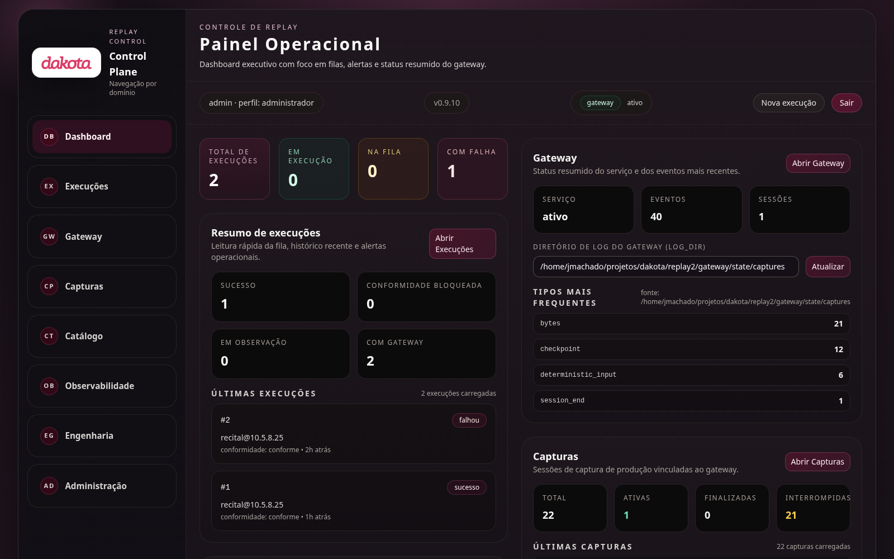

### 4.2 Capturas — lista

Status em português claro: **ativa**, **interrompida**, **concluída** —
antes apareciam `active`, `interrupted`, `finished`.

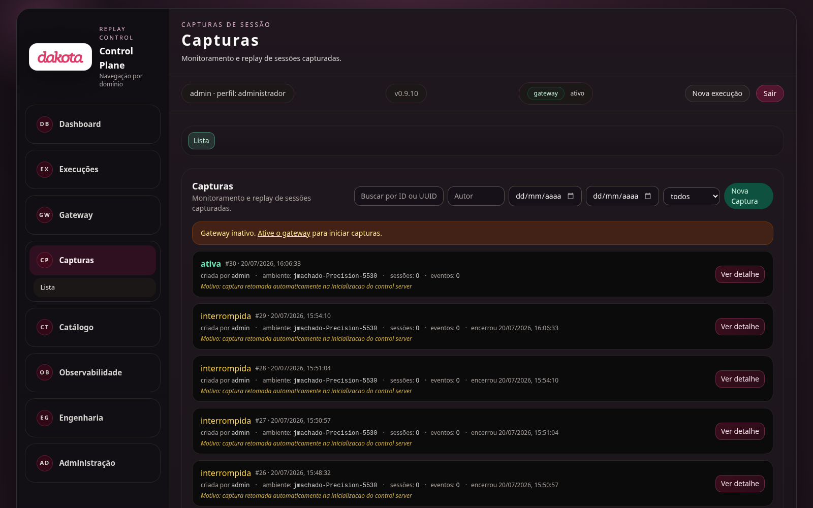

### 4.3 Detalhe da captura e dados sintéticos

Painel de replay sintético explicado em linguagem leiga ("refazer a jornada
no sistema novo"), botões **Ver** / **nova execução**, contador **teclas
verificadas** (antes: `det: N`).

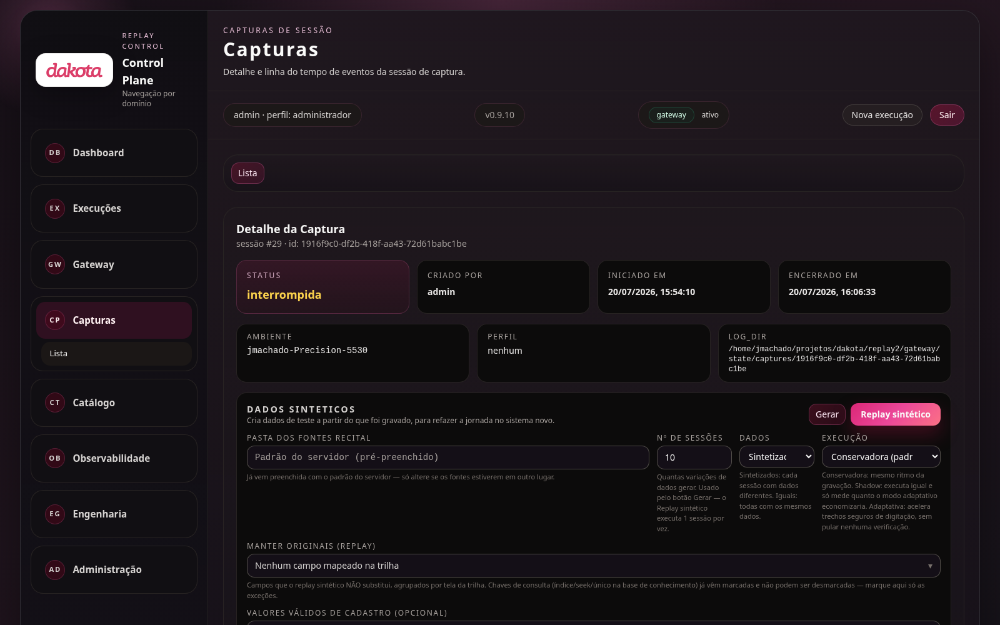

### 4.4 Execuções — aba Falhas

Filtros, chips e tabela com tipos de falha em linguagem humana
("tela diferente do esperado", "tempo esgotado"), gravidades
(crítica/alta/média/baixa) e status da execução traduzido ("#2 falhou").

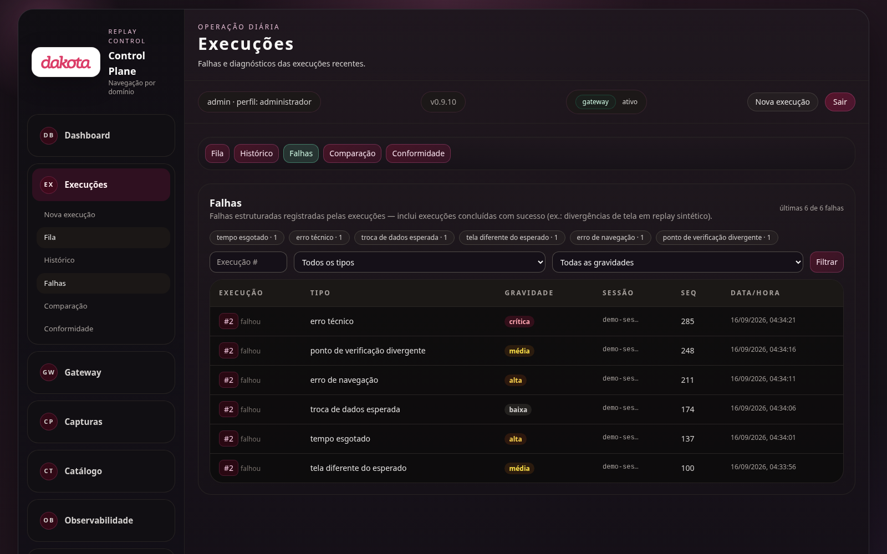

### 4.5 Detalhe da execução — falhas

Painel "Falhas por tipo" com rótulo leigo + código técnico
("erro técnico `technical_error`"), identidade com "modo sequencial
estrito", "conformidade: conforme", "entrada: via gateway".

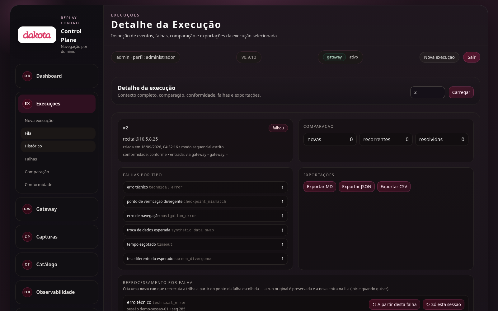

### 4.6 Detalhe da execução — motor adaptativo

Telemetria do motor de replay em português: "política: adaptativa (acelera
com segurança)", "overhead Replay2", "economia por batching", "barreiras",
"fallbacks conservadores".

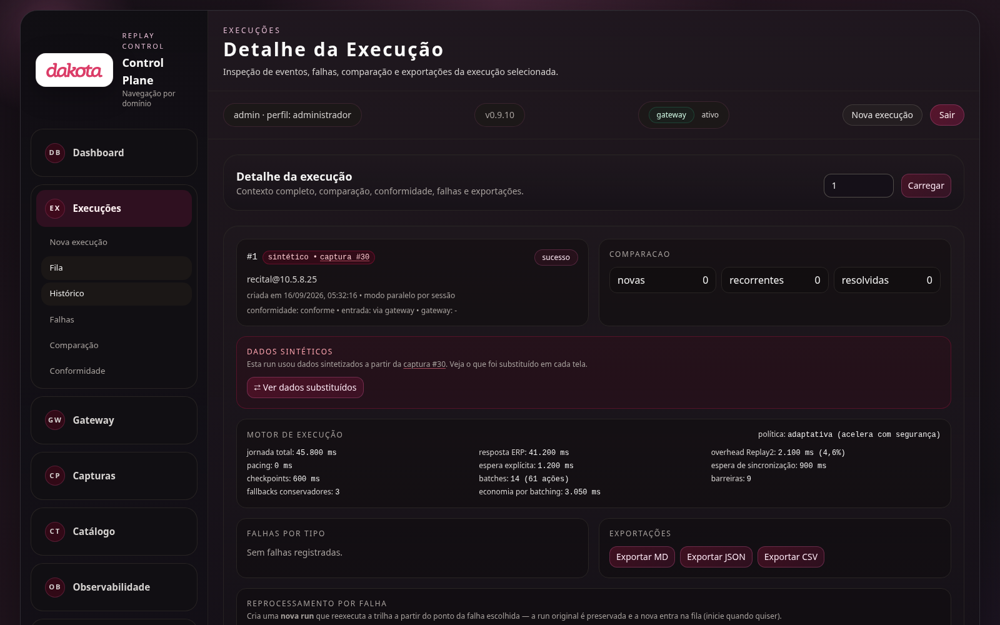

### 4.7 Nova execução

Formulário que antes era uma lista de chaves de API (`log_dir`,
`seq_global`, `session_id`) agora tem rótulos explicados: "diretório de log
(log_dir)", "sessão (session_id)", "conformidade desligada", botão
**Criar execução**.

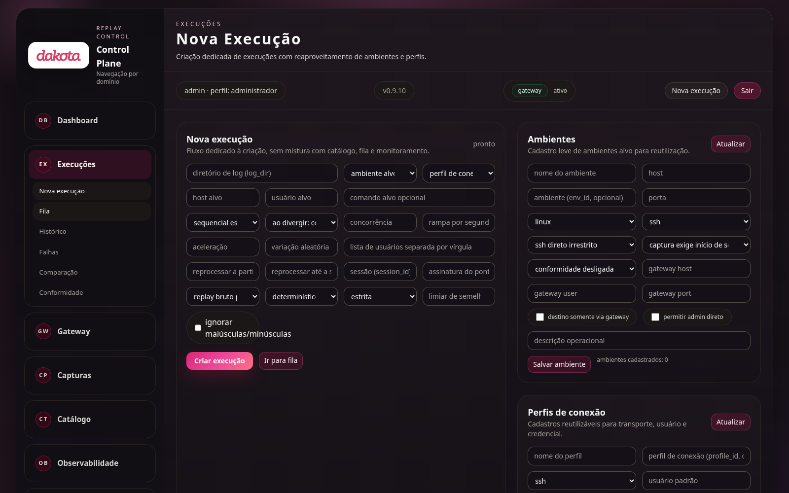

### 4.8 Gateway

"Servidor SSH", "Serviço de captura", status "ativo / aguardando conexão /
parado" (antes `running/socket/dead`), "teclas verificadas: N"
(antes `deterministic=N`), coluna "Data/hora" (antes "Timestamp").

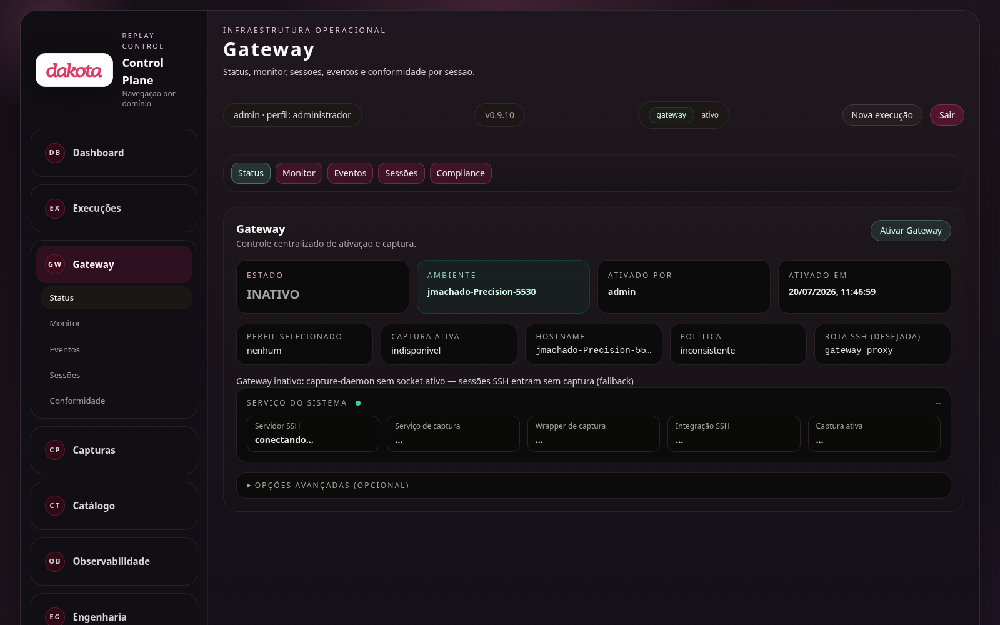

### 4.9 Catálogo

"Políticas" e "Cenários" acentuados, "acesso flexível", "execuções: N"
(antes `runs=N`), "estresse" (antes `stress`).

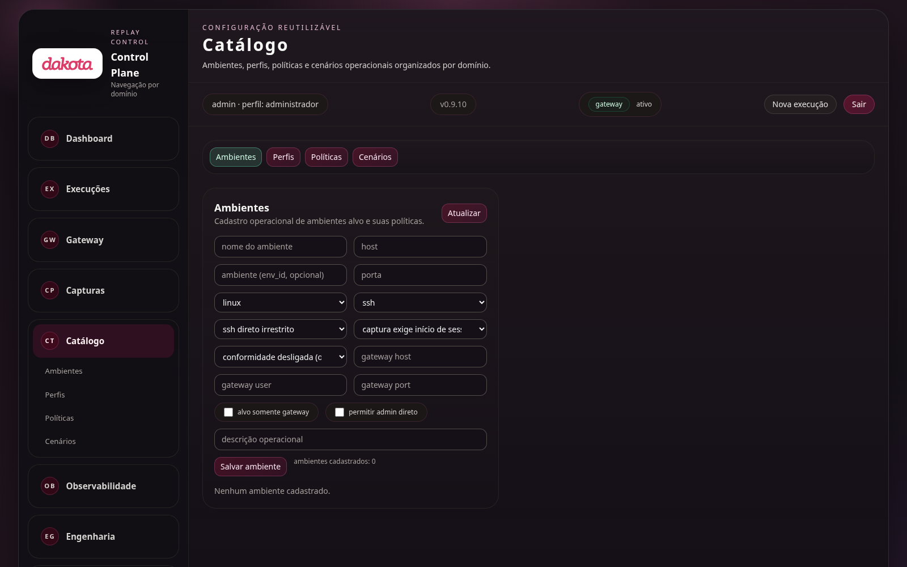

### 4.10 Observabilidade — Recursos do host

"Fila de tarefas (1 min)" (antes "Load"), seletor de execução com status e
modo traduzidos ("#42 falhou • sequencial estrito").

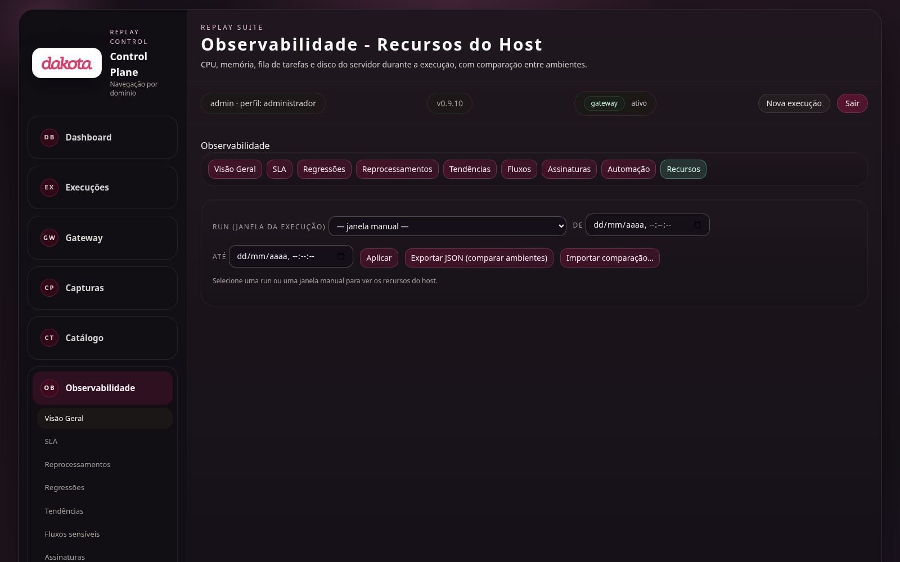

### 4.11 Benchmark

Status "em execução / concluída / criada" (antes `RUNNING/COMPLETED/
CREATED`), "referência" (antes `baseline`), vereditos APROVADO / ALERTA /
REPROVADO.

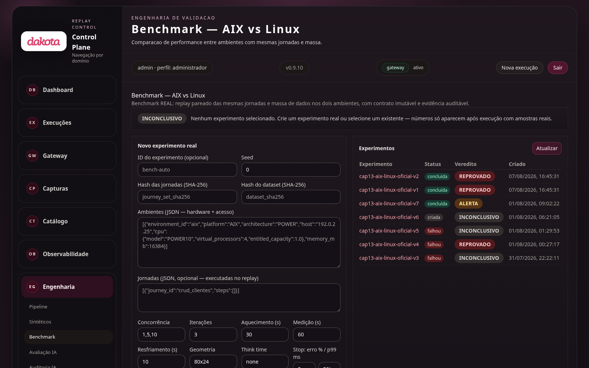

### 4.12 Avaliação IA

"Saúde do sistema" (antes "Health Score"), "Código sem uso" (antes
"Garbage"), botão "Executar avaliação", textos acentuados.

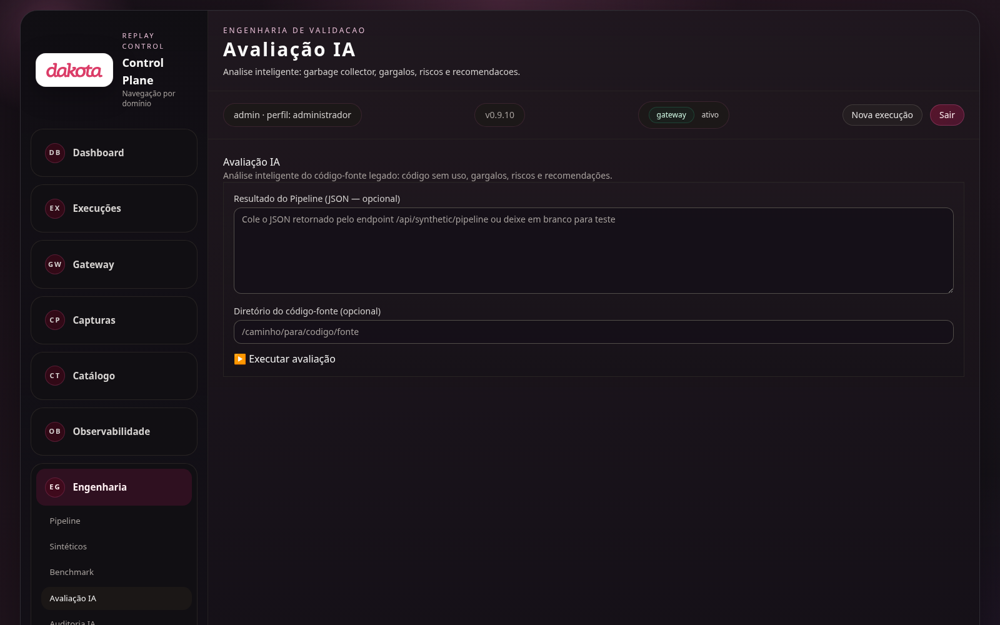

### 4.13 Pipeline

"Semente" (antes "Seed"), "Simulação — não salva (dry run)", etapas
"Descoberta → Jornadas → Síntese".

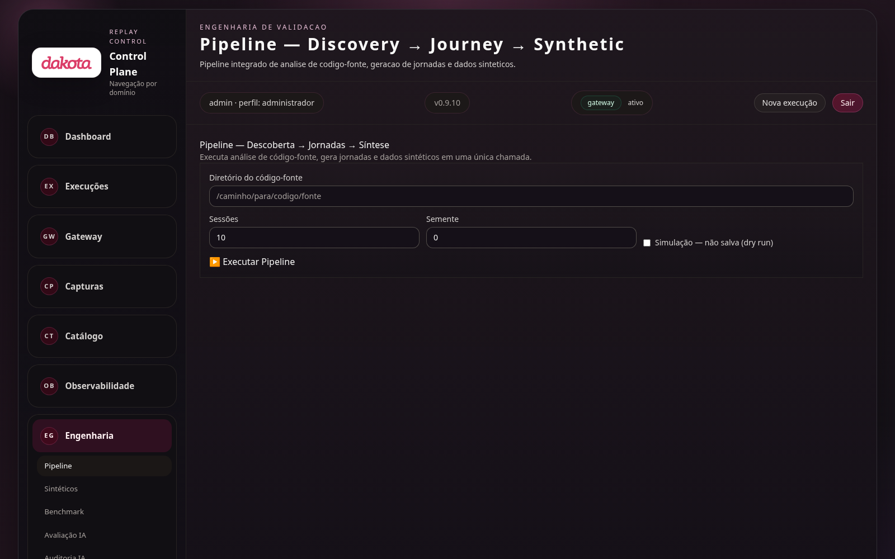

### 4.14 Sintéticos

"Jornadas de negócio", "Estresse", "Relatório", "Verificação prévia",
"semente N".

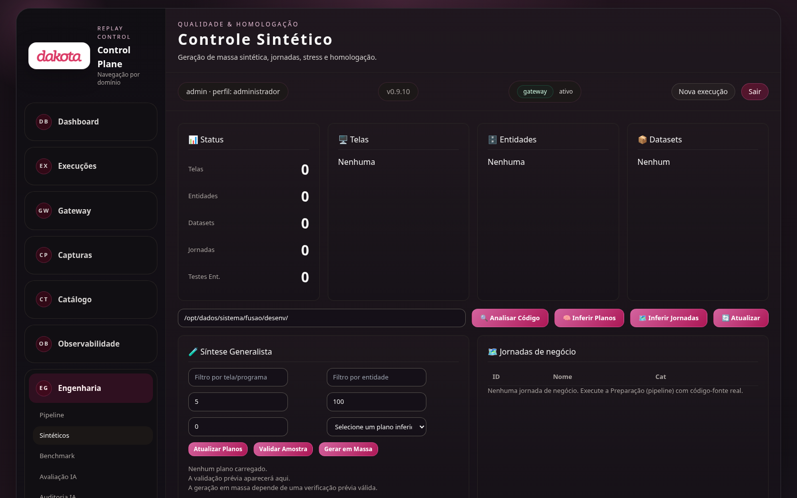

### 4.15 Administração

"perfil: administrador" (antes `role=admin`), usuário/perfis em português.

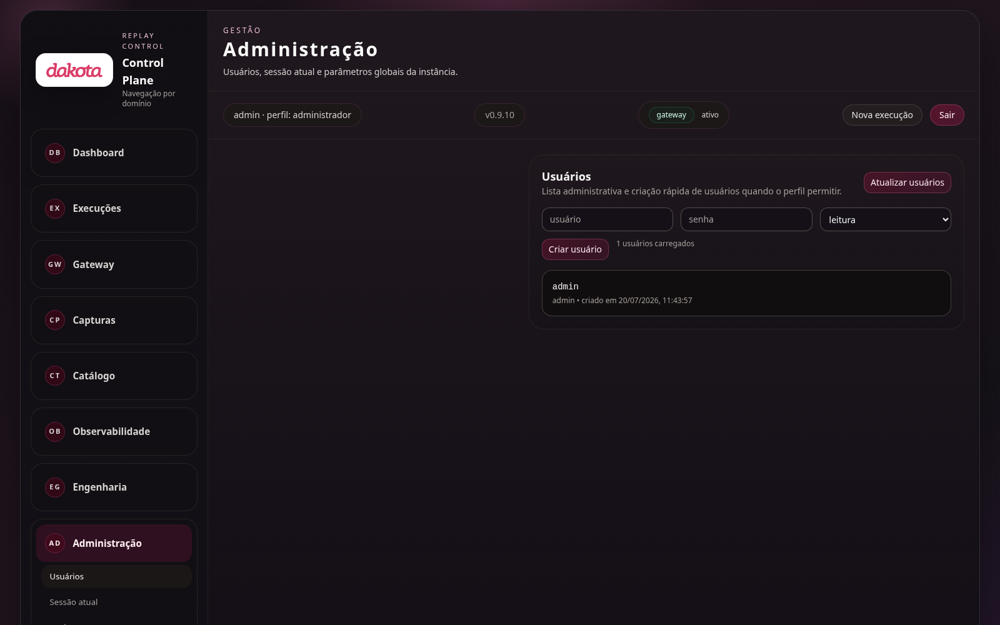

## 5. Como foi feito

- **10 levas de mudança**, cada uma um Pull Request revisado e com CI verde
  (PRs #14 a #23).
- **TDD em todas**: primeiro o teste que falha (RED), depois a correção,
  depois a suíte completa verde. Nenhum teste foi desabilitado ou
  enfraquecido; os poucos asserts que verificavam o texto antigo foram
  atualizados para o texto novo pretendido.
- **Suíte de regressão permanente**: 22 suítes JS + testes Python de rotas
  garantem que nenhum texto cru volte a aparecer.
- **Varredura sistemática**: inventário completo de jargão em todos os
  templates e arquivos JS antes de cada leva; os próprios prints deste
  documento serviram para flagrar os últimos restos (levas 8–10).

## 6. Evidências

| Item | Resultado |
|---|---|
| PRs mergeados | #14, #15, #16, #17, #18, #19, #20, #21, #22, #23 |
| Suíte JS (node --test) | 22/22 suítes verdes |
| Testes Python de rotas UI | verdes (gateway/tests: 181 passed) |
| CI (3.10/3.11/3.12, lint, coverage) | verde em todos os PRs |
| Novos testes criados | dom_labels (+), pages_lay_labels (18), templates_lay_text (16), ui_nav_labels (4), failure_table_row (+1) |
| Versão com as levas 1–6 | v0.9.10 (deployada em AIX 10.5.8.25 e Linux 10.5.8.24) |
| Levas 7–10 (menu, statusbar, falhas, dashboard) | master, próxima versão |

## 7. O que ficou de fora (de propósito)

- **Páginas de auditoria profunda**: tipos de evento (`bytes`,
  `deterministic_input`, `session_start`) e assinaturas de tela são
  vocabulário de auditoria — traduzi-los prejudicaria a investigação
  técnica. Foram mantidos, sempre com contexto ao redor.
- **Estatística da página de benchmark** (P50/P95/P99, IC95): vocabulário
  padrão de engenharia de desempenho, público técnico.
- **Valores de API, exportações e contratos**: intocados por definição.
